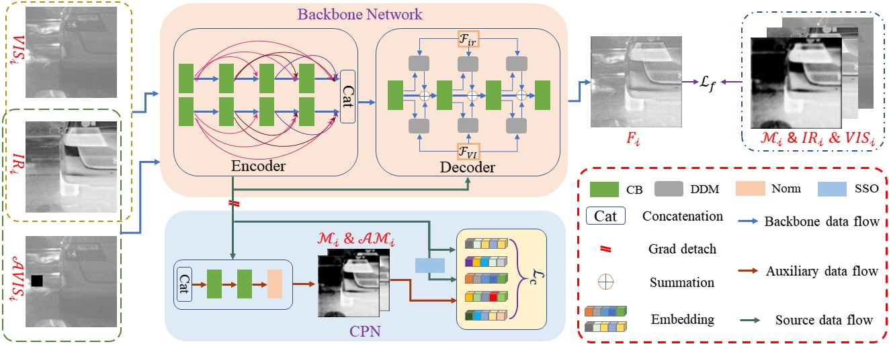
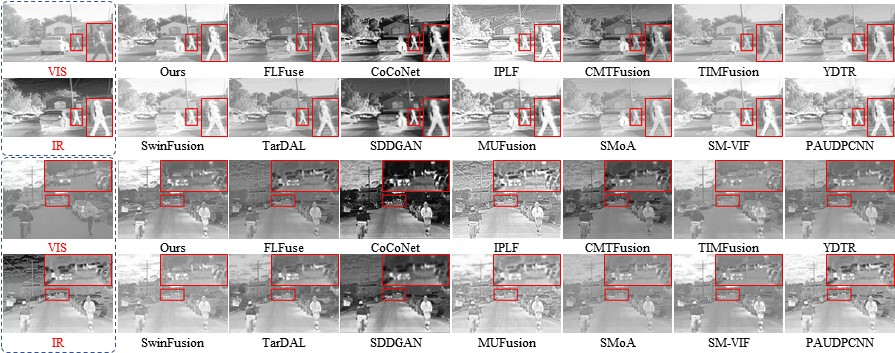

# CS2Fusion
Source code of the paper ***CS2Fusion: Contrastive Learning for Self-Supervised Infrared and Visible Image Fusion by Estimating Feature Compensation Map*** which has been accepted by INF FUS.
- [[Ppaer](https://www.sciencedirect.com/science/article/pii/S156625352300355X)]
- Xue Wang, Zheng Guan, Wenhua Qian, Jinde Cao, Shu Liang, Jin Yan

# Abstract
In infrared and visible image fusion (IVIF), prior knowledge constraints established with image-level information often ignore the identity and differences between source image features and cannot fully utilize the complementary information role of infrared images to visible images. For this purpose, this study develops a Contrastive learning-based Self-Supervised fusion model (CS2Fusion), which considers infrared images as a complement to visible images, and develops a Compensation Perception Network(CPN) to guide the backbone network to generate fusion images by estimating the feature compensation map of infrared images. The core idea behind this method is based on the following observations: 1) there is usually a significant disparity in semantic information between different modalities; 2) despite the large semantic differences, the distribution of self-correlation and saliency features tends to be similar among the same modality features. Building upon these observations, we use self-correlation and saliency operation (SSO) to construct positive and negative pairs, driving CPN to perceive the complementary features of infrared images relative to visible images under the constraint of contrastive loss. CPN also incorporates a self-supervised learning mechanism, where visually impaired areas are simulated by randomly cropping patches from visible images to provide more varied information of the same scene to form multiple positive samples to enhance the model's fine-grained perception capability. In addition, we also designed a demand-driven module (DDM) in the backbone network, which actively queries to improve the information between layers in the image reconstruction, and then integrates more spatial structural information. Notably, the CPN as an auxiliary network is only used in training to drive the backbone network to complete the IVIF in a self-supervised form. Experiments on various benchmark datasets and high-level vision tasks demonstrate the superiority of our CS2Fusion over the state-of-the-art IVIF method.
# :triangular_flag_on_post: Illustration of our DAFusion

|  |
|:-------------------------------------------:|
| **Figure 1.** The overall architecture of CS2Fusion |

|  |
|:-------------------------------------------:|
| **Figure 2.**  Demonstration of fused images from different methods |

# :triangular_flag_on_post: Testing
If you want to infer with our CS2Fusion and obtain the fusion results in our paper, please run ```test.py```.
Then, the fused results will be saved in the ```'./Fused/'``` folder.

# :triangular_flag_on_post: Training
You can change your own data address in ```dataset.py``` and use ```train.py``` to retrain the method.

# :triangular_flag_on_post: Citation
If this work is helpful to you, please cite it as:
```bibtex
@article{WANG2024102039,
title = {CS2Fusion: Contrastive learning for Self-Supervised infrared and visible image fusion by estimating feature compensation map},
journal = {Information Fusion},
volume = {102},
pages = {102039},
year = {2024},
issn = {1566-2535},
doi = {https://doi.org/10.1016/j.inffus.2023.102039},
url = {https://www.sciencedirect.com/science/article/pii/S156625352300355X},
author = {Xue Wang and Zheng Guan and Wenhua Qian and Jinde Cao and Shu Liang and Jin Yan},
keywords = {Image fusion, Contrastive learning, Feature compensation map, Identity and divergence},
abstract = {In infrared and visible image fusion (IVIF), prior knowledge constraints established with image-level information often ignore the identity and differences between source image features and cannot fully utilize the complementary information role of infrared images to visible images. For this purpose, this study develops a Contrastive learning-based Self-Supervised fusion model (CS2Fusion), which considers infrared images as a complement to visible images, and develops a Compensation Perception Network (CPN) to guide the backbone network to generate fusion images by estimating the feature compensation map of infrared images. The core idea behind this method is based on the following observations: (1) there is usually a significant disparity in semantic information between different modalities; (2) despite the large semantic differences, the distribution of self-correlation and saliency features tends to be similar among the same modality features. Building upon these observations, we use self-correlation and saliency operation (SSO) to construct positive and negative pairs, driving CPN to perceive the complementary features of infrared images relative to visible images under the constraint of contrastive loss. CPN also incorporates a self-supervised learning mechanism, where visually impaired areas are simulated by randomly cropping patches from visible images to provide more varied information of the same scene to form multiple positive samples to enhance the model’s fine-grained perception capability. In addition, we also designed a demand-driven module (DDM) in the backbone network, which actively queries to improve the information between layers in the image reconstruction, and then integrates more spatial structural information. Notably, the CPN as an auxiliary network is only used in training to drive the backbone network to complete the IVIF in a self-supervised form. Experiments on various benchmark datasets and high-level vision tasks demonstrate the superiority of our CS2Fusion over the state-of-the-art IVIF method.}
}
```

# Acknowledgement
Great thanks to the code of [CCAM](https://github.com/CVI-SZU/CCAM).
